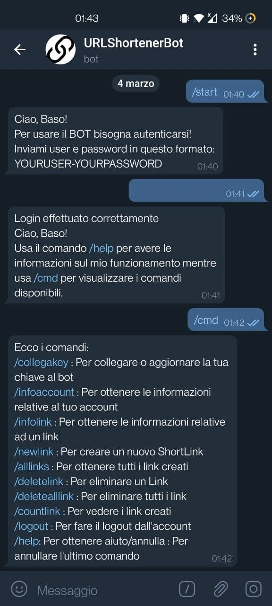

# Utilizzo del Client

## Come raggiungerlo
Come client é stato scelto un Bot Telegram raggiungibile al seguente link: [URLShortenerBot](https://t.me/thepdgt_bot)

## Come usarlo

### Avvio e Autenticazione

L'avvio del Bot avviene tramite il comando **/start** e, se non é mai stato effettuato l'accesso, verrá richeisto di autenitcarsi. In questo caso l'utente dovrà inviare tramite messaggio username e password con questa sinstassi: YOURUSER-YOURPASSWORD. Nel caso le credenziali siano corrette l'utente potrà collegare la API KEY e poi utilizzare il bot.

Dopo essersi verificati il bot se lo ricorderà e non sarà più necessario il reinserimento delle credenziali.

  
  

------------

### Configurazione iniziale

Dopo aver effettuato l'accesso, per usufruire tutte le funzionalità e i comandi é necessario collegare l'API KEY rilasciata dal sito [Rebrandly](https://rebrandly.com/) al BOT attraverso il comando **/collegakey**.
Una volta effettuato il collegamento la configurazione inziale sarà completata e il bot pronto ad essere utilizzato.

  

------------

### Comandi del Bot

Questa é lista dei comandi diponibili:

* **/start**: Comando per avviare il bot
* **/collegakey**: Comando per collegare la API KEY al Bot
* **/infoaccount**: Comando per visualizzare le informazioni realtive all'account
* **/infolink**: Comando per visualizzare le informazioni relative di un link
* **/newlink**: Comando per creare un link ridotto
* **/alllinks**: Comando per visualizzare la lista dei link creati e le loro informazioni
* **/deletelink**: Comando per eliminare un link 
* **deletealllink**: Comando per elimianre tutti i link creati
* **/countlink**: Comando per contare tutti i link creati
* **/logout**: Comando che permette di effettuare il logout dal Bot
* **/annulla**: Comando per annullare il comando precedente