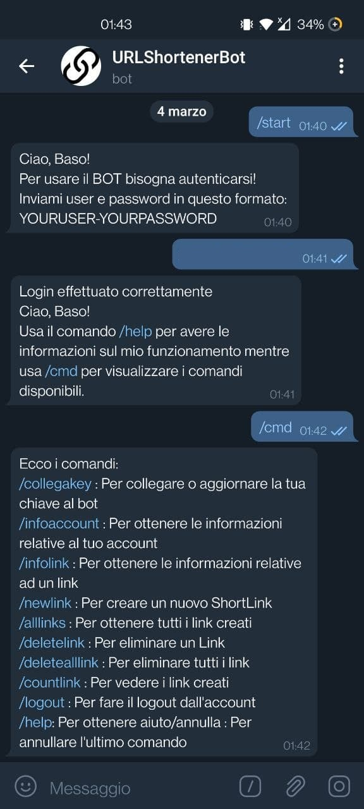
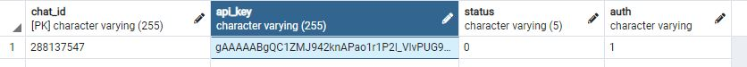

# Scelte di Progetto

- Come linguaggio di programmazione é stato scelto **Python** poiché é molto versatile e ha una community molto grande.

------------

- **Heroku** é stato scelto come piattaforma per hostare il Web Service poiché si sincronizza autoamticamente con questa GitHub repository.
Inolte é stato usato per salvare in modo sicuro alcune varibili d'ambiente essenziali per il funzionamento del Web Service ma che non potevano essere mantenute nel DataBase come ad esmpio il Token del Bot o le credenziali di accesso del DB stesso.

------------

- Per permettere il corretto funzionamento del bot Telegram e per salvare i dati é stato scelto come DBMS **PostgreSQL** perché permette di gestire,interrogare e salvare i dati con facilitá.
In questo caso viene usato per mettere in corrispondenza tra di loro: **Chat Id** (Variabile che identifica lo utente che invia il messagio), la **API KEY**, lo **status** (variabile utilizzata per far capire al Bot quali sono le intenzioni dell'utente) e un flag, **auth**, che serve identificare se l'utente ha effettuato l'accesso o meno al bot (autenticazione).

------------

## Sicurezza

Per garantire maggiore sicurezza sono state implementate 2 misure:

* **Autenticazione**: L'utente per poter utilizzare il bot Telegram deve prima autenticarsi inserento un unsername e una password direttamente in chat. Convalidate le credenziali avrà accesso alle funzionalità e ai comandi;

  

* **Oscuramento API KEY**: l'API KEY prima di essere salvata nel DB viene criptata attravrso un'implementazione della Crittografia Simmetrica, nello specifico quella di [Fernet](https://cryptography.io/en/latest/fernet.html). Così facendo viene garantita una maggior privacy dei dati, i quali non possono essere letti direttamente dal DB se non si è in possesso della chiave di criptazione.

  

